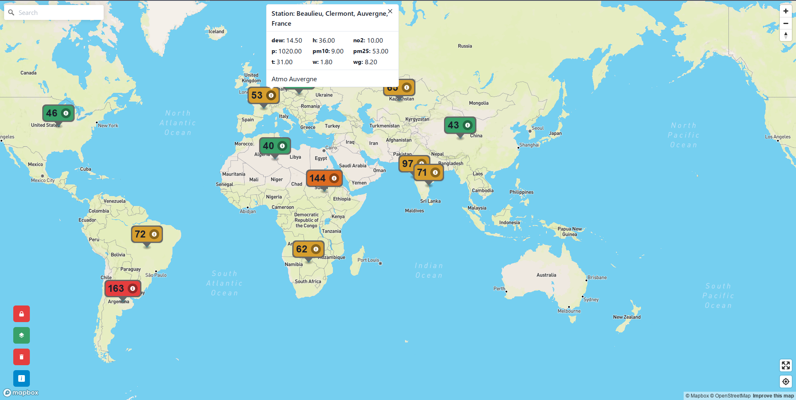

  
  <h3>Interactive map for visualizing air quality index</h3> 

## Contents
- [Introduction](#introduction)
- [Screenshot](#screenshot)
- [Environment Variables](#environment-variables)
- [Run and Build Locally](#run-locally-and-build)
- [Deploy](#deploy)
- [Contributing](#contributing)
- [Authors](#authors)
- [License](#license)

## Screenshot

|  |                                
|-------------------------------|
| Vaayu Screenshot              |                                                                                                                                                            

## Introduction

- Vaayu is an interactive world map for getting air quality index of any location on earth by clicking on the map
- It even gives advanced statistics like dew, pm2.5, no2 etc..
- Visit [vaayu.coolfool.me](https://vaayu.coolfool.me) for interacting with the map
- You can [deploy](#deploy) your own instance on aws-amplify or netlify with one click deploy

## Environment Variables

- `REACT_APP_MAPBOX_ACCESS_TOKEN` - MAPBOX API TOKEN (from [mapbox.com](https://www.mapbox.com/))
- `REACT_APP_AQI_ACCESS_TOKEN` - AQICN API TOKEN (from [aqicn.org](https://aqicn.org/api/))

## Run Locally and Build

- Clone the repo `git clone https://github.com/coolfool/vaayu.git`
- Cd into the repo `cd vaayu`
- Create a .env file and set the required variables
- Execute `npm install`
- To run locally `npm start` and visit `localhost:8080`
- To build `npm run build`
- The output should be in `dist` directory

## Deploy

- 
- 

## Contributing

Contributions are what make the open source community such an amazing place to learn, inspire, and create. Any contributions you make are **greatly appreciated**.

If you have a suggestion that would make this better, please fork the repo and create a pull request. You can also simply open an issue with the tag "enhancement".
Don't forget to give the project a star! Thanks again!

1. Fork the Project
2. Create your Feature Branch (`git checkout -b feature/AmazingFeature`)
3. Commit your Changes (`git commit -m 'Add some AmazingFeature'`)
4. Push to the Branch (`git push origin feature/AmazingFeature`)
5. Open a Pull Request

(<a href="#top">back to top</a>)

## Authors

- [@coolfool](https://www.github.com/coolfool)

(<a href="#top">back to top</a>)

## License

[MIT](https://choosealicense.com/licenses/mit/)

(<a href="#top">back to top</a>)

